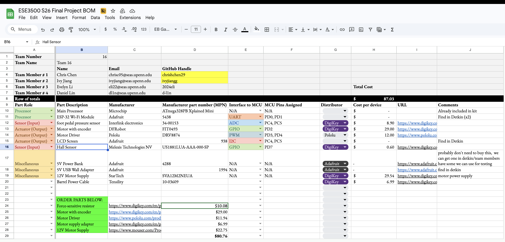
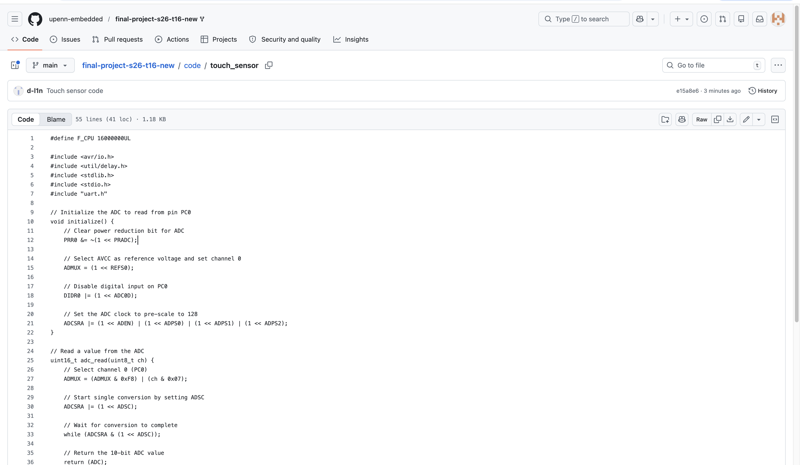
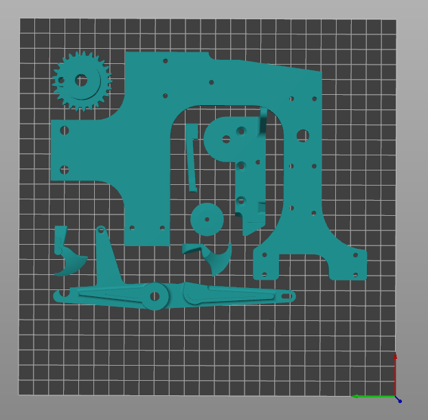
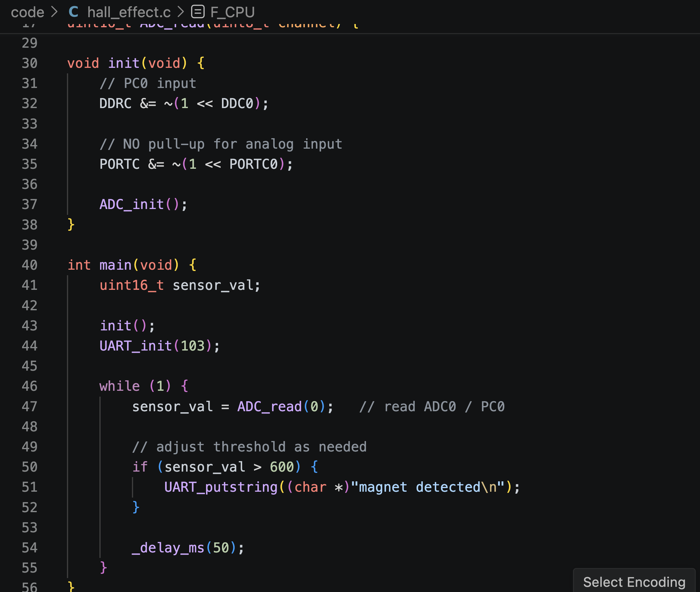
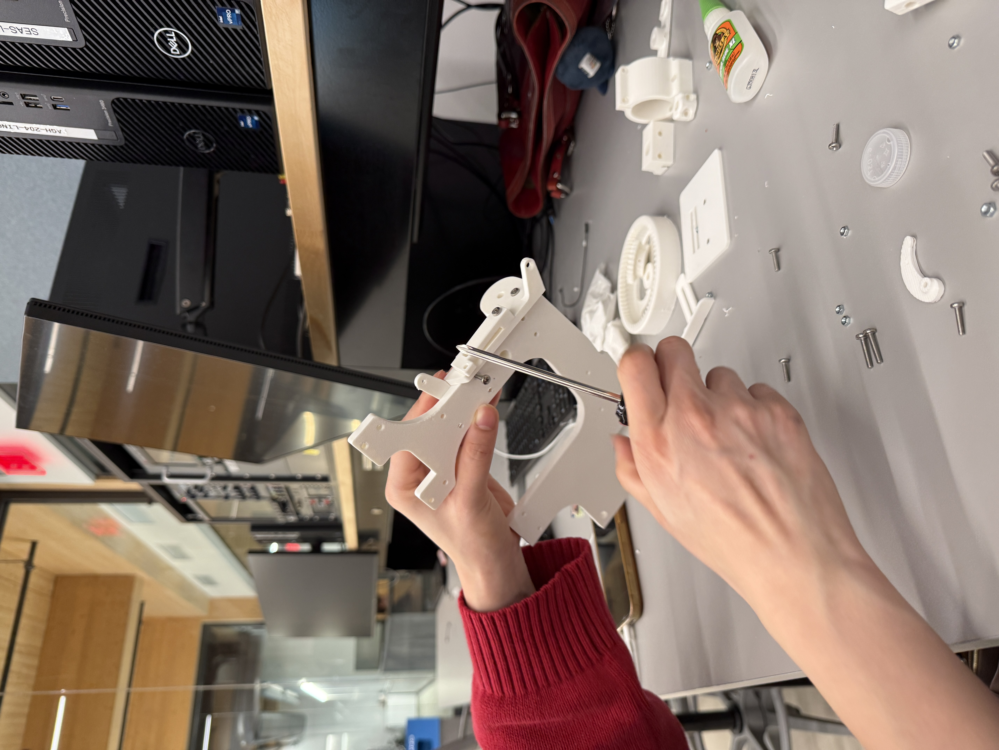

# Final Project

**Team Number:** T16

**Team Name:** Sewing Machine

| Team Member Name | Email Address             |
|------------------|---------------------------|
| Chris Chen       | chrisc05@seas.upenn.edu   |
| Ivy Jiang        | ivyjiang@seas.upenn.edu   |
| Evelyn Li        | eli22@seas.upenn.edu      |
| Daniel Lin       | dl1n@seas.upenn.edu       |

**GitHub Repository URL:** https://github.com/upenn-embedded/final-project-s26-t16-new

**GitHub Pages Website URL:** [for final submission]*

## Final Project Proposal

### 1. Abstract

Our final project is a smart sewing machine with a wireless foot pedal and built-in thread usage tracking. The wireless pedal will use a pressure sensor to detect how hard the user is pressing and send that input to the sewing machine, which will adjust motor speed in real time. A second part of the system will track spool or shaft rotation to estimate how much thread remains and display that information to the user on an OLED or other indicator. Overall, the project combines wireless communication, sensor input, motor control, and user feedback into one integrated embedded system.

### 2. Motivation

Conventional sewing machines usually use wired pedals and provide limited real-time information about machine operation. This creates usability limitations, including restricted pedal placement and difficult portability. Furthermore, there is no clear indication of the remaining thread or machine state. This is especially annoying when sewing complex pieces; users have to guess and check when to replace bobbin and spool thread and precision is limited by eyeballing. Our project addresses this by adding a wireless pressure-sensitive pedal and a sensing system that estimates thread usage during operation.
This project is interesting because it requires real-time interaction between mechanical and embedded subsystems. The device must sense pedal pressure, filter and transmit the input, adjust motor speed, count machine rotations, and provide output through a display or indicators. The intended purpose is to build a more flexible and informative sewing machine system that improves user control while demonstrating strong embedded system integration.
It is also just cool because some members in our group love to sew and the chain locking mechanism is a marvel in itself, so it could be a cool mechanism to figure out. 

### 3. System Block Diagram

We will need to 3D print the sewing machine components. Further, for the body and internal support of the machine, we will need power tools to cut it out of wood or acrylic. 

### 4. Design Sketches

### 5. Software Requirements Specification (SRS)

**Pedal Pressure to Speed Mapping**  
The pedal MCU reads pressure and maps it to motor speed (higher pressure → higher speed).  
Validation: Apply ≥5 pressure levels and verify speed increases monotonically.

**Wireless Command Transmission**  
The pedal MCU sends speed commands wirelessly to the sewing machine MCU.  
Validation: Perform ≥20 trials with ≥95% successful reception and response.

**Real-Time Motor Control** 
The machine MCU adjusts motor speed based on pedal input.  
Validation: Test ≥5 inputs and verify speed settles within 2 s.

**Rotation Counting**  
The MCU tracks rotations using an encoder, Hall, or optical sensor.  
Validation: Compare measured vs. actual rotations with ≤5% error.

**Thread Estimation**  
Remaining thread is estimated from rotation count and spool geometry.  
Validation: Compare estimate vs. expected value with ≤10% error.

**User Feedback**  
System provides status via LED/OLED (power, thread, state).  
Validation: Verify LED power indication and display updates during operation.

**Chain Stitch Mechanism**  
The mechanism produces a continuous chain stitch.  
Validation: Test on fabric and verify stitch remains continuous.

**Power Transmission**  
Motor drives stitching mechanism without slip or stall.  
Validation: Test across speed range and verify consistent motion.

**Frame Stability**  
Structure remains stable during operation.  
Validation: Run for several minutes and check for vibration or loosening.

**Pedal Usability**  
Pedal supports repeated presses and returns to neutral.  
Validation: Perform ≥50 cycles and verify consistent return and integrity.

**Spool Support**  
Spool rotates smoothly and remains mounted.  
Validation: Run repeated tests and verify no jamming or detachment.                                                                     |

### 6. Hardware Requirements Specification (HRS)

**Wireless Foot Pedal Hardware**  
The system includes a portable foot pedal with an embedded pressure sensor and microcontroller to detect user input and transmit speed commands wirelessly.  
Validation: Apply repeated low, medium, and high pressure inputs and verify that the pedal produces distinct sensor readings and successfully transmits commands.

**Dual-MCU Architecture**  
The system uses two separate microcontrollers: one in the wireless pedal for pressure sensing and transmission, and one on the sewing machine for motor control, display output, and spool/thread monitoring.  
Validation: Test each MCU separately, then validate the full system by confirming that pedal input is received and acted on by the machine-side MCU.

**Motor Drive Hardware**  
The sewing machine includes a motor and motor driver capable of rotating the stitching mechanism at variable speeds based on pedal input.  
Validation: Operate the motor at multiple commanded speeds and verify continuous rotation and response to speed changes without stalling under normal operation.

**Rotation Sensing Hardware**  
The machine includes a sensor, such as an encoder, Hall-effect sensor, or optical sensor, to detect spool or shaft rotation for thread-usage estimation.  
Validation: Rotate the shaft or spool through a known number of turns and verify that the sensor output matches the actual number of rotations.

**User Feedback Hardware**  
The system includes at least one output device to indicate machine status, such as an OLED display or LED indicators.  
Validation: Power on the system and confirm that the display or indicators activate correctly and update during operation.

**Power System**  
The device includes a power source and regulation hardware capable of safely powering both microcontrollers, the wireless pedal, sensors, display, and motor-driving circuitry.  
Validation: Run the full system under normal operation and verify that all components remain powered and functional without unintended resets or brownouts.

**Pressure Sensor Resolution**  
The foot pedal pressure sensor provides enough range to distinguish at least three input levels: low, medium, and high pressure.  
Validation: Record sensor outputs at different applied pressures and confirm that the three levels are clearly distinguishable.

### 7. Bill of Materials (BOM)
[BOM](https://docs.google.com/spreadsheets/u/1/d/1LjAFRgd7g9gQXnkkUFB2_QBa0-whRiNNrxztL-SXp3Q/edit?usp=sharing)   

First, the source of our compute/signal processing for this project is the ATmega328PB XPlained mini board. This is ideal because it provides sufficient compute for processing of simple sensor data, is cheap and highly flexible when tuned with baremetal code. To facilitate wireless communication between two of these boards, a Feather ESP32 Wi-Fi module will be connected to each MCU. This is preferred because the Feathers provide bluetooth capabilities that are ideal for short distance, light-weight communication. They also provide access to wifi which gives us the flexibility of incorporating data storage, and IOT with this system without requiring significant changes in storage.
For our power source, we will utilize 3 sources in our testing phase. A 5V power bank will be utilized to power our foot pedal. A power bank is preferred because they have built in power regulation and are small and portable which is the entire purpose of having a detached foot pedal. 5V adapters plugged into the walls will be used to power the peripherals on the sewing machine side. For the motor, a separate 12V supporting 2A power adapter plugged into the wall will be used. We want to separate the power supply of the motor from the peripherals because the motor can cause significant current/voltage spikes.
Our pedal must be able to distinguish between multiple states which we do using a pressure sensor. We chose the FSR 402 because it has a sensing range of 0.3N to 150N which is the relative range that makes the pedal easy to control and not require too much force. The sensor is also durable supporting 10 million + actuations and has mm thickness. 
For our motor, we choose the FIT0493 motor because it is relatively inexpensive, contains a built in encoder, supports PWM and should have more than enough torque at 12kg/cm. It takes 12V and draws a max current of 1.65A. Our motor driver supports this by being able to provide up to 3A. This is all supported by our 12V adapter. 
We also require an LCU to display information to the user. In all honesty, the specs for this are unimportant for the operation of the device as long as SPI communication is supported. 
We also use a hall-effect latch for spool rotation tracking rather than an optical sensor because sewing might produce significant debris and a magnetic sensor handles that well. Our chosen sensor takes in 5V and only requires 5mA to operate which matches well within the rest of the system.

### 8. Final Demo Goals

Will it be strapped to a person, mounted on a bicycle, or require outdoor space?
* It is a standalone machine with a portable foot pedal and connected to a battery, so no need to be strapped to anything or anyone.

Think of any physical, temporal, and other constraints that could affect your planning.
* Some constraints that can affect planning is that a sewing machine isn’t something that we can fit in a bag; it is quite big, so storage could be a constraint as well as methods to transport the parts back and forth. 

### 9. Sprint Planning

How will you plan your sprint milestones?
* We will plan our sprint milestones as semi-long term goals. Focus on 1-2 big goals max and separate into 2 person groups to complete mini parts that work up to completing the overarching goal. For example if the unit time is 1 week, we will have the goal we want completed by the end of the week defined clearly. After defining this goal, define the sub goals that will be completed to complete the overall goal. Then, block out specific time blocks throughout the week to fulfill each goal. Finally, leave a few hours in case some tasks take longer than anticipated. 

How will you distribute the work within your team?
* Everyone will be present when planning the sprints. We will just discuss which work we want to do and split accordingly. Nothing will be assigned without approval and we will discuss during in person sprint planning and over text for unanticipated tasks that come up.

**This is the end of the Project Proposal section. The remaining sections will be filled out based on the milestone schedule.**

## Sprint Review #1

### Last week's progress
This past week, we finalized BOMed (and order), worked on an intial physical CAD (and sent out to print) and wrote an inital version of the embedded code for the foot pedal system.

In terms of the BOM, the biggest change we made compared to the inital write up was we switchd the force sensor to a different model with a larger surface area for ease of integration and use. We also realized the power adapter we were planning on using does not source enough current to account for spikes in the motor so we made changes to this. 

In terms code for the foot pedal, we have written and tested the functionality for measuring and reading the force from the sensor. This is the core of the control system. 

For the physical CAD, we started from example CAD models on the internet and made the necessary adjustments to incorporate our components and detach the foot pedal from the rest of the machine to make our design more convenient and portable. Some of our components that we sent for printing are shone below.

Finally, we met as a team and aligned on direction and plans/goals for next week. 

### Current state of project
Currently, the project is off to a good start. We have a very basic preliminary MVP of our "foot-pedal" system (both circuit and code) which is a core part of the project that will ultimately allow the user to control the sewing machine. We also have a first version for the gears and enclosure of the sewing machine. 

Right now, the biggest bottleneck is just waiting for components to come in. That is, we have ordered electronic parts and are awaiting those to ship. We have also sent out 3D print jobs to RPL and are waiting for the first print to come back so we can iterate. The reason we want to the physical enclosure to come right now 1. printing takes a long time and 2. we want to make sure the elecontric components fit within the mechanical CAD and the gear works as expected. 

In the meantime we are able to progress with components that are in Detkin. Some of these are parts we will use in our final version (feather, LCD screen, Hall sensor etc.) and some are alternate versions we are just using for test (force sensor, small motor)

### Next week's plan
Estimated time: 2 hours 
Assigned: Daniel, Chris 

Finalize foot-pedal subsystem - stress test code, integrate feather for wifi communication, integrate LCD screen displaying status. Being done means have a working system that consistently measures accurate pressue, is able to send it wirelessly and display it visually. Provided 3D print finishes in time, we also want to have this integrated. This group will also be responsible for following up with the 3D print and ensuring all components are printed/accounted for.

Estimated time: 2 hours
Assigned: Evelyn, Ivy

Begin the code and electronics to measure the amount of yarn left/used. This will mean building and testing the hall sensor electroncs and writing the code to support this. We also want to integrate feather for wifi communication on the ATMega connected to this system. Being done means having a hall sensor that can accurate measure rotations and communicte that via wifi. 

*Note: not too much work assigned for this sprint due to midterms and team plans to meet for long work session the Sunday immediately after Sprint 2 is due. 

## Sprint Review #2

### Last week's progress
This past week, we wrote code to verify the functionality of the hall-effect sensor set up the circuitry. The hall effect is up and functional.

 We also partially assembled our mechanical sewing machine.
 
 
  We re-CAD'd/ordered additional parts based on first iteration assemblies. We realized we need metal rods to support the physicaly sewing machine and act as axels for spinning parts. The power supply we ordered was also missing part of the adpater so we reordered this too.
  
  We also cadded the enclosure for the foot pedal sensor and MCU. 
  [text](sprint2-3.heic)

  Our motor driver came so we created a basic test circuit and verified that it works by driving a PWM signal using the detkin power supplies.
  [text](sprint2-2.heic)

### Current state of project

    I think currently we are on good pace. The hall effect sensor, motor, force sensor all have rough, working versions set up. The next step will be to polish up code a bit more and connect all these sections together via the ESP-32. We wanted to get this done last week, but we realized this is lower priority because other tasks require more iteration and may require ordering of additional parts + 3D printing new components which has a longer lead time. 

    The biggest current roadblocks are 1. we are waiting for metal rods to come in so that we can finish the mechanial assembly of our sewing machine. We are also waiting for the new power adpater head to come in so that we can test the operation of our project without relying on the power supply. 

    In the meantime, we will keep testing and integrating using the detkin power supply. We have also 3D printed rods that we can use for now while we wait for the metal rods to come in. 

### Next week's plan

Assigned: Evelyn, Ivy, Daniel, Chris
Estimated time: 8 hours

We will fully assemble the sewing machine and test to see if the motor can move the machine. We will also attach the hall sensor and magnet to the spool in order to measure rotations. We will also connect the LCD screen so that it displays rotations.

Overall, we want to polish the different electrical subsystems and integrate them together and support wireless communication. We hope to be ready for the MVP!

## MVP Demo

### 1. Show a system block diagram & explain the hardware implementation.

### 2. Explain your firmware implementation, including application logic and critical drivers you’ve written.
For firmware, we implemented the embedded control stack across two microcontrollers that coordinate the sewing machine. On the pedal-side controller, Daniel wrote ADC sensing logic to continuously sample the pressure sensor, filter readings, and convert force input into a speed command. We then built the wireless communication layer using ESP-NOW/Wi-Fi to transmit pedal data with low latency and confirm successful packet delivery.

On the sewing-machine controller, we developed/used existing UART drivers and wrote parsing logic to receive commands from the wireless bridge, then used that data for real-time motor control so pedal pressure directly maps to motor speed. Also wrote application logic for telemetry peripherals, including Hall-effect sensor (showing that we can sense change but haven't fully done rotation counting yet) for thread usage estimation and display update routines for user feedback, but these haven't been fully integrated as they were secondary priorities. 

### 3. Demo your device.
Showing a TA + will record. 

### 4. Have you achieved some or all of your Software Requirements Specification (SRS)?
Yes, we've achieved all our SRS except that telemetry which is on its way to being done. 

### 5. Have you achieved some or all of your Hardware Requirements Specification (HRS)?
Yes, we've fully built out our sewing machine and all parts are integrated into the system. 

### 6. Show off the remaining elements that will make your project whole: mechanical casework, supporting graphical user interface (GUI), web portal, etc.
Mostly just telemetry. 

### 7. What is the riskiest part remaining of your project?
Stress testing and making sure we don't break the machine.

### 8. What questions or help do you need from the teaching team?
None as of now. Just maybe how to improve?

### Current state of project

We are in good shape for the final demo. Almost everything works functionally except for the display and hall effect sensor for telemetry which is a stretch goal that we can work on in the following week. 

### Next week's plan

We will integrate the display and hall effect sensor for telemetry into the sewing machine and integrate it into existing code. Since we've finished a rough MVP for this week, we can now work on polishing the circuit boards -- soldering rather than using breadboards -- as well as making our code readable and modularized. 

Also we would like to stress test our machine to make sure it won't break on Demo Day. 

## Final Report

Don't forget to make the GitHub pages public website!
If you’ve never made a GitHub pages website before, you can follow this webpage (though, substitute your final project repository for the GitHub username one in the quickstart guide):  [https://docs.github.com/en/pages/quickstart](https://docs.github.com/en/pages/quickstart)

### 1. Video

### 2. Images

### 3. Results

#### 3.1 Software Requirements Specification (SRS) Results

| ID     | Description                                                                                               | Validation Outcome                                                                          |
| ------ | --------------------------------------------------------------------------------------------------------- | ------------------------------------------------------------------------------------------- |
| SRS-01 | The IMU 3-axis acceleration will be measured with 16-bit depth every 100 milliseconds +/-10 milliseconds. | Confirmed, logged output from the MCU is saved to "validation" folder in GitHub repository. |

#### 3.2 Hardware Requirements Specification (HRS) Results

| ID     | Description                                                                                                                        | Validation Outcome                                                                                                      |
| ------ | ---------------------------------------------------------------------------------------------------------------------------------- | ----------------------------------------------------------------------------------------------------------------------- |
| HRS-01 | A distance sensor shall be used for obstacle detection. The sensor shall detect obstacles at a maximum distance of at least 10 cm. | Confirmed, sensed obstacles up to 15cm. Video in "validation" folder, shows tape measure and logged output to terminal. |
|        |                                                                                                                                    |                                                                                                                         |

### 4. Conclusion

## References

