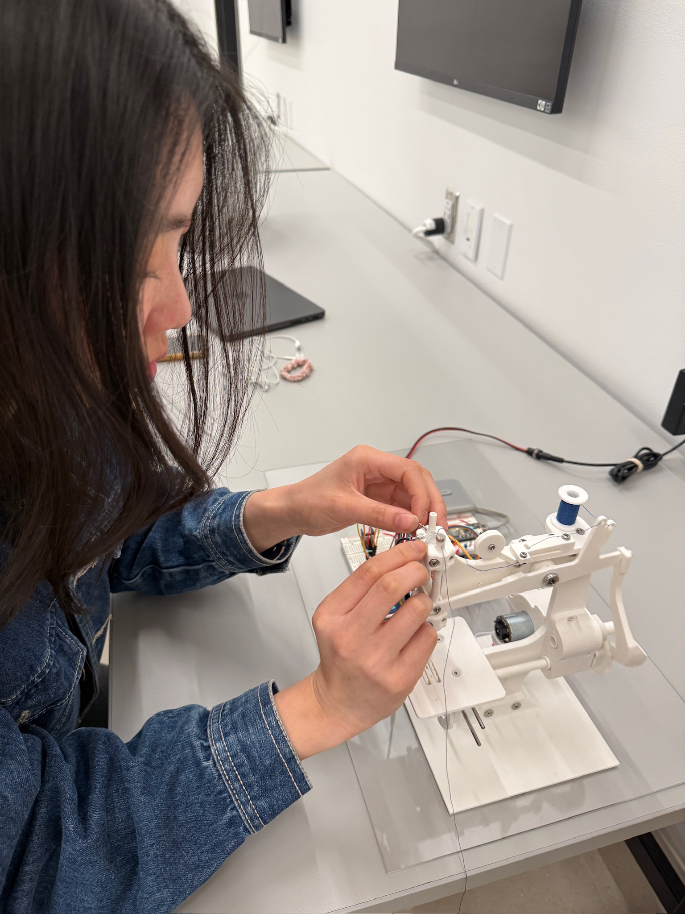
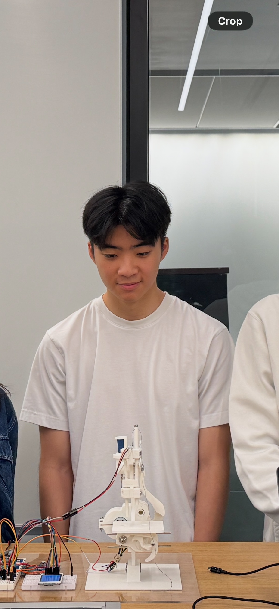
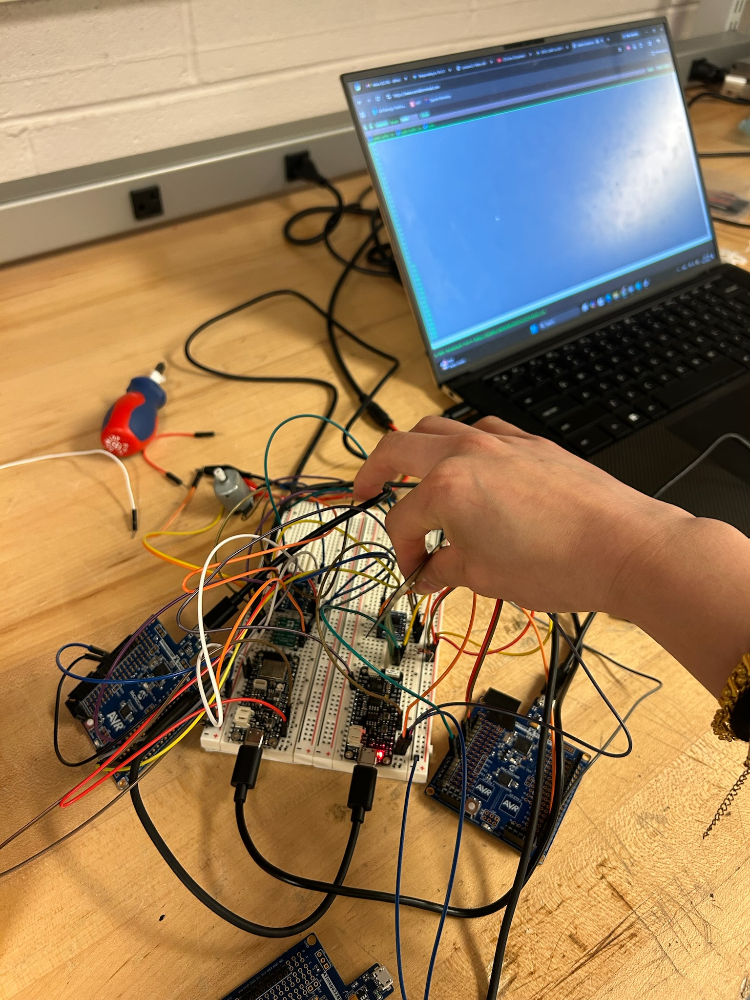
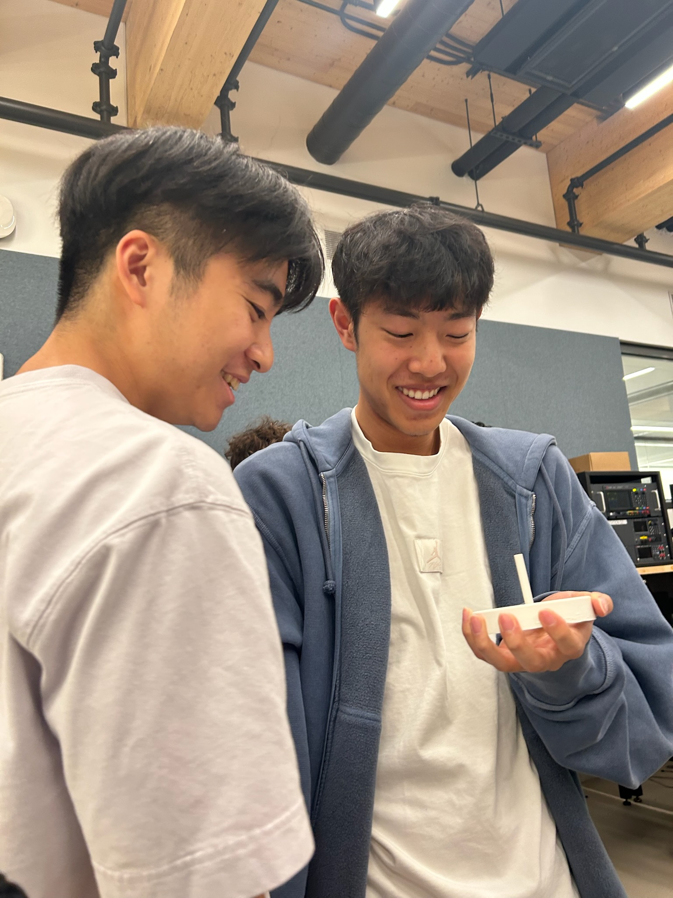
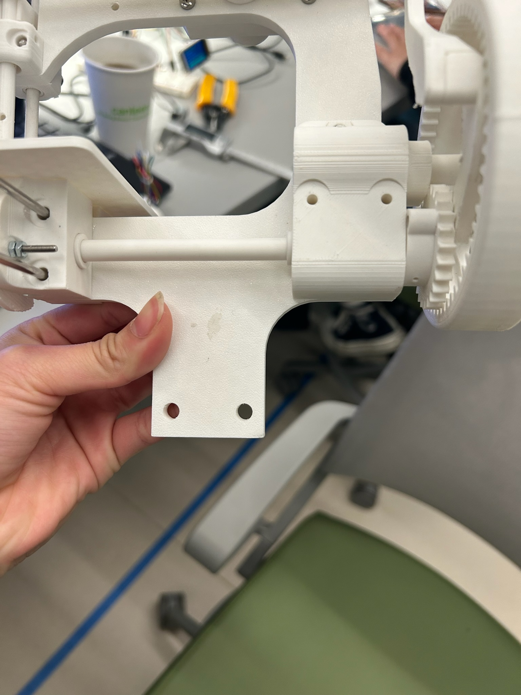
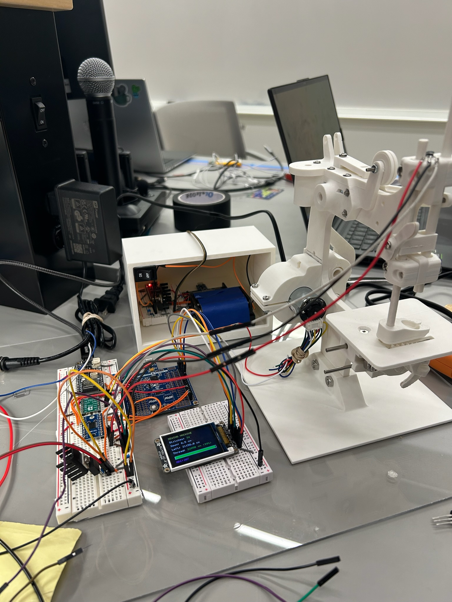
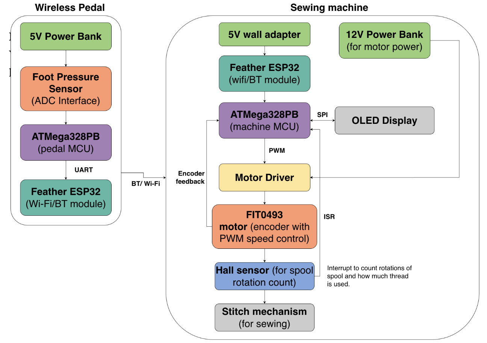
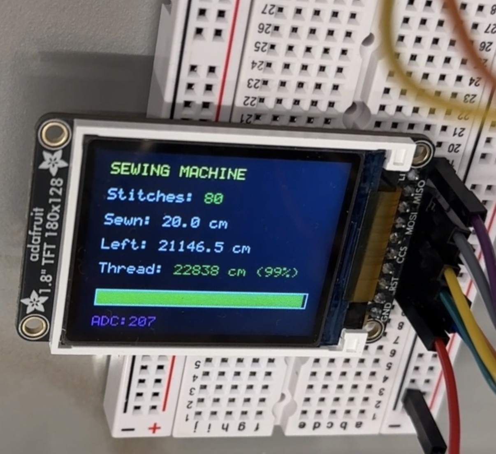

# Gertrude

ESE3500 Final Project: Embedded Sewing Machine for wireless control and smart resource usage prediction

## Video

  <iframe 
    src="https://www.youtube.com/embed/aF5EwkLu-dE" 
    frameborder="0" 
    allowfullscreen
    style="position: absolute; top: 0; left: 0; width: 100%; height: 100%;">
  </iframe>

[Open demo video](https://www.youtube.com/watch?v=aF5EwkLu-dE)

## Images

  
  
  
  
  

## Progress Shots

  
  
  
  
  
  
  

## Results

In the end, our sewing machine "Gertrude" was very close to the product we envisioned
from the beginning. It contained a PLA 3-D printed sewing machine complete with fully
function gears, hooks and pedals powered by a DC motor. It possessed a detached
"foot-pedal" that utilized a force sensor to control the speed of the sewing machine and
use 2 ATMegas to handle embedded computations and 2 ESPs running ESP-Now to handle
wireless communication. Finally, a hall effect sensor was used to measure yarn usage
and display relevant information like "total stiches" on an onbard LCD screen.

## Software Requirements Specification (SRS) Results

Based on our quantified system performance, we were able to meet most of our core software requirements, particularly those related to user interaction and system feedback. The LCD display requirement (SRS-06) was fully achieved, as the system consistently provided real-time updates of stitch count and system status. This demonstrated strong integration between sensing, processing, and user output, and validated that our software pipeline from sensor input to display was reliable.

However, we fell slightly short in fully meeting the rotation counting requirement (SRS-04). While the Hall-effect sensor successfully detected and tracked spool rotations, small inaccuracies were observed, especially at higher motor speeds. These errors were likely caused by missed sensor transitions or noise in the signal, indicating limitations in our polling or interrupt handling approach. Although the system functioned correctly at a conceptual level, the measured counts did not always remain within the desired accuracy range.

Overall, the system achieved its primary functional goals, with reliable real-time control and feedback. The remaining shortcomings are primarily related to signal robustness and measurement precision, which could be improved through better interrupt handling, signal conditioning, or filtering in future iterations.

| ID | Description | Validation Outcome |
| --- | --- | --- |
| **SRS-04** | The sewing machine microcontroller shall track spool or shaft rotations using a Hall-effect sensor. | Partially Confirmed, the Hall sensor and magnet successfully incremented rotation/stitch count displayed on the LCD, matching visible spool movement during operation. Minor inaccuracies occurred at higher speeds due to missed transitions or signal noise. Demonstrated in demo video and system output 
| **SRS-06** | The system shall provide user feedback through an LCD display to indicate system status and usage metrics such as stitch count. | Confirmed, the LCD powered on correctly and updated in real time to reflect stitch count and system state during operation. Consistent behavior is shown in demo video and images 

SRS-04 Proof:

  <iframe 
    width="315" 
    height="560"
    src="https://www.youtube.com/embed/GNKjsASPulc"
    frameborder="0"
    allowfullscreen>
  </iframe>

[Open SRS-04 proof video](https://www.youtube.com/watch?v=GNKjsASPulc)

SRS-06 Proof:

## Hardware Requirements Specification (HRS) Results

We met almost all of the hardware requirement initially outline in our project proposal. A brief overview of these requirments and our ultimate design is discussed below:

### Wireless Foot Pedal Hardware

The system shall use two separate microcontrollers: one located in the wireless pedal for pressure sensing and transmission, and one located on the sewing machine for motor control, display output, and spool/thread monitoring.

Validation: Yes, this was met and the locations were as planned. This is demonstrated in the images above.

The sewing machine shall include a motor and motor-driving circuit capable of rotating the stitching mechanism at variable speeds based on pedal input.

Validation: Yes, this was met, and a functioning motor is outline in the demo video.

The machine shall include a hardware sensor, such as an encoder, Hall-effect sensor, or optical sensor, to detect spool or shaft rotation for thread-usage estimation.

Validation: We did include sensors to count spool usage/number of rotations in the form of a hall effect sensor and magnet. Agin, demonstrated in demo video.

The system shall include at least one hardware output device to indicate machine status, such as an OLED display and/or LED indicators.

Validation: The visual display came in the form of a status LED on the sewing machine side ATMega as well as the LCD screen turning on.

### Power System

The device shall include a power source and regulation hardware capable of safely powering both microcontrollers, the wireless pedal, sensors, display, and motor-driving circuitry.

Validation: This was achieved and functioning machine is proof of that. Specifcally, we utlized 6 AA battery back, 9V to 5V and 3.3V LDO, wall to 12V socket and fixed 5V portable power supply.

| ID | Description | Validation Outcome |
| --- | --- | --- |
| HRS-01 | The system shall include a portable foot pedal with an embedded pressure sensor and microcontroller to detect user input and transmit speed commands wirelessly. | Confirmed, could communicate wirelessly up to 50+ meters away. [Video1](validation/Video1.mov) shows example of wireless communication working. |
| HRS-07 | The foot pedal pressure sensor shall provide enough measurable range to distinguish between at least three user input levels: low, medium, and high pressure. | Confirmed, could see very visible differences in motor speed depending on force applied. End of demo video on website shows difference speeds, LCD screen shown in [Video1](validation/Video1.mov) also zooms in on ADC reading of pressure sensor. |

## Conclusion

In conclusion, we had a lot of fun but also learning moments working on Gertrude. We learned a lot about debugging and working step by step up from a minimum viable product to a fully embedded sewing machine. 
What went well was that we planned out our time very well and were able to rapidly prototype if a design wasn't working or if a part was missing. For instance, we initially had significant issues getting our UART bridge to work between the ATMega used to sense the ADC value on the pressure sensor to the ESP-32, transmitting over ESP-NOW to the second ESP-32, and getting the value from the secon ESP-32 to the second ATmega over UART for processing with the motor. We found this issue to be because we were trying to read from UART channel 2 on the second ESP-32 when in reality the ESP-32 we used only had two UART channels (channel 0 and channel 1). We spent significant time debugging this issue (on the order of several hours) and the fact that we planned our time very well meant that we were able to resolve issues like this without it pushing back our timeline too much. Another major issue we face was on the integration side. When we tried to integrate the code controlling our motor duty cycle with the code for the Hall effect sensor and the LCD screen, we found that neither the LCD screen nor the motor worked properly. We eventually found out that the cause of this issue was that both them motor driver and the LCD screen used timer 0 on different channels, so our integrated code only worked when we switched the LCD screen to timer 2.

We were also a super communicative team, so it was easy to know what to work on and how to get it done. Overall, pretty much everything worked except that the needle was misaligned causing our machine to be unable to stitch. To solve this problem, next time, we would probably align the hook better so that it could grab the needle thread at the right moment. In general, we could probably have spent more time iterating on the open-source CAD design we found to meet our design requirements, because some of the open-source CAD files did not match what we were looking for - for instance, the model we used was designed to be run with metal rods, but we only had access to 3D-printed rods which made the tolerance issues of our device worse. Overall, we're super proud of the team for pushing through challenges and making a functional sewing machine!

## References
ESP-Now 

UART Library (Labs 1-4)

LCD Library (Lab 4)

